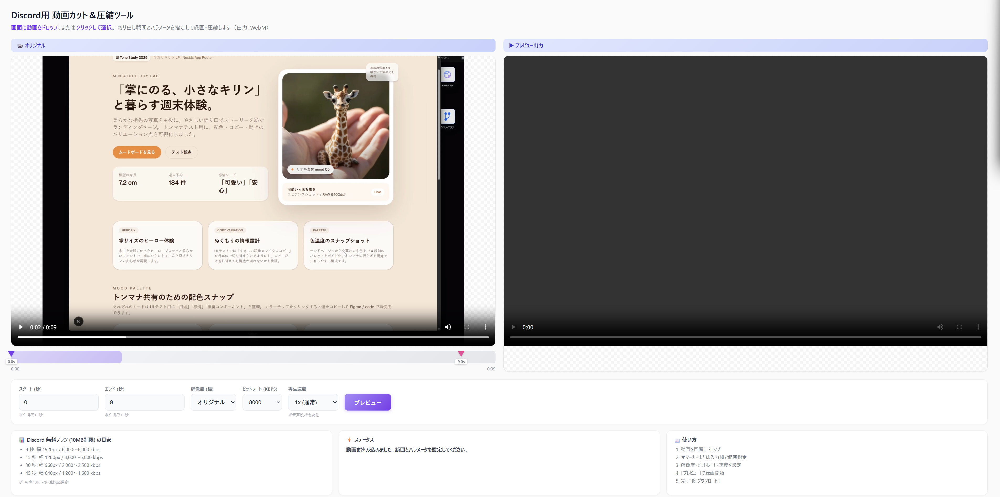

# Discord用 動画カット＆圧縮ツール

Discord無料プランの10MB制限に対応した、ブラウザベースの動画編集ツール。

🔗 **[ツールを使う](https://wory-bonbon.github.io/discord-video-compressor/)**

## 機能

- **動画のカット**: 開始・終了位置を指定して必要な部分だけ切り出し
- **圧縮**: 解像度・ビットレートを調整してファイルサイズを削減
- **再生速度変更**: 0.5x〜2xの速度でタイムラプス風の出力も可能（音声も同じ速度で変化）
- **プレビュー**: ダウンロード前に結果を確認
- **完全ローカル処理**: サーバーへのアップロードなし、プライバシー安全

## 使い方

1. 動画ファイルを画面にドラッグ&ドロップ（またはクリックして選択）
2. タイムライン上のマーカーをドラッグ、または秒数を入力して範囲指定
3. 解像度・ビットレート・速度を設定
4. 「プレビュー」で録画開始
5. 完了後「ダウンロード」

## Discord 10MB制限の目安

| 長さ | 解像度 | ビットレート |
|------|--------|-------------|
| 8秒  | 1920px | 6,000〜8,000 kbps |
| 15秒 | 1280px | 4,000〜5,000 kbps |
| 30秒 | 960px  | 2,000〜2,500 kbps |
| 45秒 | 640px  | 1,200〜1,600 kbps |

※ 音声128〜160kbps想定

## 技術仕様

- 出力形式: WebM (VP9/VP8 + Opus)
- 処理方式: Canvas + MediaRecorder API
- 対応ブラウザ: Chrome, Edge, Firefox（最新版推奨）
- 依存ライブラリ: なし（Vanilla JS）

## ライセンス

MIT License
